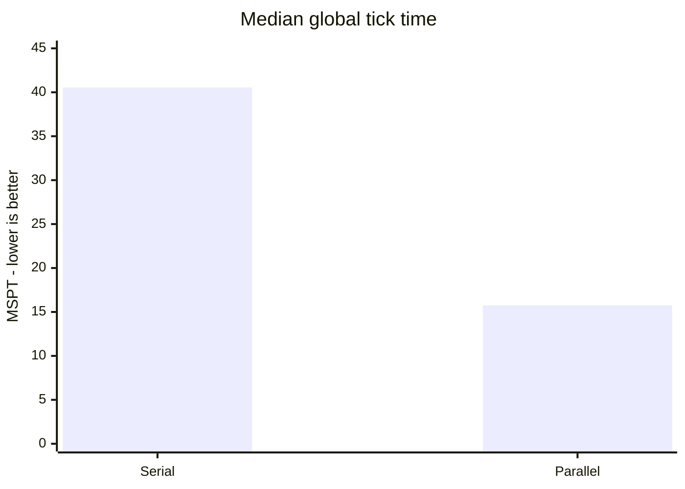
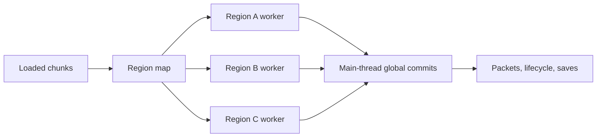

# Tessellate

Tessellate is a Fabric and NeoForge performance mod for Minecraft 1.21.1. It groups distant loaded areas into
independent regions and lets those regions run on different CPU cores. If one region gets too
expensive, Tessellate can slow it down without dragging the rest of the server with it.

Support and discussion: [join the Tessellate Discord](https://discord.gg/dPY6zmHtr5).

## Downloads

Download Tessellate from [CurseForge](https://www.curseforge.com/minecraft/mc-mods/tessellate).

| Situation | What Tessellate does |
| --- | --- |
| Several distant bases are busy | Runs their regions concurrently |
| One region exceeds the server budget | Reduces only that region's simulation rate |
| Two regions become close enough to interact | Merges them before they tick |
| A worker reaches unsafe shared state | Falls back to serial ticking for the session |

This works best when players or forced-loaded areas are spread out. One dense base, mob farm, or
machine cluster is still one region, so Tessellate cannot split that work across several cores. It also
doesn't replace single-thread optimizers such as [Lithium](https://modrinth.com/mod/lithium); the two
solve different problems.

## Current benchmark

For the current benchmark, we ran an ABBA sequence and restarted the server before every arm. The
test used four forced-loaded regions 2,048 blocks apart, each with exactly 1,200 persistent zombies
(4,800 total). Both modes used adaptive throttling and the same nine-mod setup. The only setting we
changed was `parallelTicking`.



**Parallel ticking cut median MSPT by 61.2% and p95 MSPT by 62.5%.** All four regions held 20 TPS in
both parallel runs. In the serial runs, the adaptive budget had to slow some regions because their
work could only run one after another.

| Mode, median of two arms | Median MSPT | Median p95 | Regions at 20 TPS | Slowest region |
| --- | ---: | ---: | ---: | ---: |
| Serial regional ticking | 40.55 ms | 50.80 ms | 0/4 and 1/4 | 10.0-10.6 TPS |
| **Parallel regional ticking** | **15.75 ms** | **19.05 ms** | **4/4 in both arms** | **20.0 TPS** |

<details>
<summary>Raw arms and benchmark controls</summary>

| Arm | Median MSPT | Median p95 | Regions at 20 TPS | Slowest region |
| --- | ---: | ---: | ---: | ---: |
| Serial A | 40.1 ms | 50.8 ms | 0/4 | 10.0 TPS |
| Parallel A | 15.1 ms | 18.8 ms | 4/4 | 20.0 TPS |
| Parallel B | 16.4 ms | 19.3 ms | 4/4 | 20.0 TPS |
| Serial B | 41.0 ms | 50.8 ms | 1/4 | 10.6 TPS |

- Hardware: Intel Core Ultra 7 255H, 16 cores, Java 21.
- Runtime: Minecraft 1.21.1, NeoForge 21.1.248, Lithium 0.15.4, C2ME
  0.4.0-alpha.0.120, Mekanism and Mekanism Generators 10.7.19.85, Naturalist 2.0.3,
  Citadel 2.7.1, Friends & Foes 4.0.27, Resourceful Lib 3.0.12, and ScalableLux
  0.3.0-alpha.0.8.
- Each arm discarded two 8-second warmup windows, then used the median of five 8-second samples.
- `asyncRegionLoops=false` in both arms so `tick query` included the worker critical path. Shipping
  async mode does not join workers every tick, so its main-thread MSPT is not directly comparable.
- `ItemEntity.Age`, a vanilla field outside Tessellate, measured each region's effective TPS.
- Every arm verified exact entity count, separate regions, correct execution mode, drained boundary
  queues, and zero boundary failures. Parallel arms also required worker overlap of at least two.

Reproduce the same serial/parallel sequence with:

```bash
bash tools/ab_parallel.sh 4 1200
```

</details>

This benchmark is deliberately built around several separate regions. It is not a promise of the
same speedup on every server. One hot region still runs on one core, and different mixes of mobs,
machines, and mods will behave differently.

---

## How it works



Each worker handles the local simulation for its region. Anything that touches shared Minecraft or
mod state is queued and applied on the main thread once the region is safe.

### Regions

Tessellate divides the loaded world into **sections** of 4x4 chunks. Nearby entity-ticking sections are
joined into a **region**, and that whole region ticks as one unit.

With the default settings, regions merge when they come within 2 sections of each other. Two
separate regions are therefore at least 3 sections (192 blocks) apart, far enough that one cannot
reach the other during a single tick.

The map updates as chunks load and unload. Run `/tessellate regions` to see it.

### Regional TPS: slicing, not skipping

Tessellate measures the cost of each region every tick. If the server is about to miss its tick-time
target, the most expensive region gets a **tick divisor**. A divisor of 4 runs that region at 5 TPS
while unaffected regions can stay at 20.

Running the whole region once every fourth tick would produce the right average rate, but it feels
awful in play:

| | gated (all work every 4th tick) | sliced (1/4 of the work every tick) |
| --- | --- | --- |
| bystander's TPS | 19.6 | **20.0** |
| MSPT, mean | 20.5 ms | 23.7 ms |
| MSPT, **95th percentile** | **210.9 ms** | **32.9 ms** |

That gated version caused a 200 ms hitch every fourth tick, which made everyone stutter. Tessellate
instead runs a quarter of the region's entities on every tick. Each entity still averages 5 TPS,
but the work is spread out.

Entity IDs and block positions determine slice membership, so the same mob or hopper stays in the
same slice each cycle.

The throttle looks at the whole tick before deciding whether to step in. Chunk work, networking,
and block entities outside regions all consume time that regions cannot control, so the available
region budget is whatever remains under `targetTickMillis`. If the server is comfortably holding
20 TPS, nothing is throttled.

### Parallel region ticking

Separate regions cannot interact during a tick, which makes it possible to run them on different
threads. The harder part is keeping every shared boundary safe:

- **Entity storage is sharded by grid cell.** Vanilla keeps every entity section in one map plus
  one balanced tree. Sharding by *cell* rather than by region matters: a section key's coordinates
  are chunk coordinates, so the shard is a pure function of the key, and regions merging or
  splitting migrates nothing.
- **Entity lifecycle callbacks run on the main thread.** One entity crossing a chunk section
  updates six level-global containers: entity tracking, the player list, mob navigation, dragon
  parts, game-event listeners, and the mod event bus. Workers queue those and the main thread
  replays them, which replaces six concurrency problems with one rule.
- **Scheduled ticks are region-owned.** Each region has an ordinary vanilla `LevelTicks` child;
  chunk tick containers move between children at quiescent topology changes. Owner-local writes
  stay on the worker and cross-owner writes are handed off.
- **Block events are region-owned.** Each region has an ordered, deduplicating queue. Its block
  callbacks run on the owner worker; only successful event packets and positional sound/network
  effects are committed on the main thread.

Most simulation stays on the region worker. Shared work crosses one of these measured boundaries:

| boundary | region-worker work | main-thread commit or global barrier |
| --- | --- | --- |
| scheduled block/fluid ticks | drain the region-owned vanilla `LevelTicks` child | cross-owner scheduling is handed to the destination owner |
| chunk/random ticks | tick with worker-local vanilla random state | chunk/player broadcasts and packet delivery |
| entity ticks | core entity simulation | add/remove lifecycle, persistent callbacks, and entity insertion |
| teleports/dimension changes | request the transition | replay the transition after the source owner is idle |
| block-entity ticks | core block-entity simulation | ticker and fresh block-entity registration |
| block events | ordered owner callback queue | successful packets and positional sound/network effects |
| natural spawning | independent searches with one snapshot and atomic cap reservations | entity insertion and vanilla spawn-state replay |
| custom spawners/mod callbacks | none | arbitrary global mod code remains main-threaded |
| commands | none | quiesce all owners, drain handoffs, then execute the whole command |
| autosave/chunk unload | none while the owner is active | busy autosaves retry and direct saves lease the owner; optional C2ME can serialize unload snapshots on its workers |
| explicit saves and shutdown | none | quiesce and drain before taking the global snapshot or closing storage |
| topology merge/split | none while owners are active | wait affected owners, drain against old ownership, then replace the map |

`/tessellate phases` reports queued, replayed, direct, pending, elapsed main-thread time, failures,
balance, and the last source region for each boundary. The counters are bounded by boundary type;
they do not retain an ever-growing region history.

With `asyncRegionLoops=true`, a busy region keeps its ownership claim and only misses its own next
slot. Other regions and the main server tick continue instead of waiting at a global barrier.
Targeted leases protect packets, commands, chunk topology, entity loading and unloading, and saves.

Tessellate runs this ownership path without C2ME and has no build, metadata, or class dependency on it.
Vanilla prepares a safe unload snapshot on the main thread and writes it asynchronously. If C2ME is
installed, it can also run `ChunkSerializer.write` for that snapshot on its workers. Loaded
autosaves are still serialized during an idle main-thread slice; they do not wait on a busy region.

### Validation coverage

| Check | Result |
| --- | --- |
| JVM regression suite | 81 tests passed |
| Tessellate-only NeoForge GameTests | All 5 required tests passed without external mods |
| Scheduled ticks | 30 minutes, 422 rebuild cycles, worker peak 5, no failure or queued work left |
| Block events | 30 minutes, 1,001,984 callbacks, worker peak 4, packets stayed on main |
| Natural spawning | Three parallel runs, worker overlap confirmed, global and local caps held |
| Deferred writes | 6,947 level writes and 2,592 entity callbacks replayed exactly |
| Full-mod save/unload | 1,200 entities survived a 49-chunk unload/reload exactly |
| Main-thread boundaries | 8,519 deferred operations balanced with zero pending work |

These checks cover the workloads listed here, not every possible mod interaction. The serial
fallback is still necessary because no test suite can prove that arbitrary mod code is thread-safe.

---

## The trade-off

Throttling has an intentional cost: when a region exceeds its share, **everything inside it runs
slower**. Mobs move more slowly, farms produce less, and hoppers move fewer items. That is useful for
containing a lag machine, but Tessellate cannot tell a lag machine from a legitimately busy base. It
will slow either one.

If you would rather let the whole server drop below 20 TPS than slow a player's build, set
`regions.adaptiveThrottling = false`. Region tracking stays on and you keep the `/tessellate regions`
diagnostics.

---

## Configuration

`config/tessellate-common.toml`.

| option | default | what it does |
| --- | --- | --- |
| `regions.enabled` | `true` | region tracking; off makes the mod inert |
| `regions.adaptiveThrottling` | `true` | the regional TPS system |
| `regions.budgetMillis` | `25.0` | minimum budget retained for region work |
| `regions.targetTickMillis` | `45.0` | tick time to steer toward; raise to intervene later |
| `regions.maxTickDivisor` | `16` | slowest a region may be driven (1.25 TPS) |
| `regions.minThrottleMillis` | `2.0` | regions cheaper than this are never slowed |
| `regions.sectionShift` | `2` | region grid granularity, 4x4 chunks |
| `regions.parallelTicking` | `true` | tick regions on worker threads |
| `regions.directWorkerChunkReads` | `true` | resolve loaded worker chunk reads before synchronous-load instrumentation |
| `regions.parallelNaturalSpawning` | `true` | run owner-region spawn searches concurrently with level-wide cap reservations |
| `regions.shardEntityStorage` | `true` | storage isolation required by `parallelTicking` |
| `regions.asyncRegionLoops` | `true` | independent per-region loops without a per-tick barrier |
| `regions.scopedScheduledTicks` | `true` | region-own block/fluid schedulers; false uses one serial fallback child |
| `regions.scopedBlockEvents` | `true` | region-own block-event callbacks; false uses the serial fallback queue |
| `compatibility.mainThreadEntities` | `["creaturefeature:toadstool"]` | entity types forced onto the main thread until their mods adopt the compatibility API |
| `compatibility.forceSerialMods` | `[]` | loaded mod IDs that force serial region ticking for the session |
| `compatibility.rulesEndpoint` | Tessellate's public rules table | curated compatibility restrictions; blank disables remote rules |
| `compatibility.rulesApiKey` | public key | read-only rules key; never use a service-role key |
| `compatibility.reportEndpoint` | Tessellate's report service | sends structured failure reports; blank opts out |
| `compatibility.reportApiKey` | public key | report-service key; blank opts out; never use a service-role key |

To return to serial regional ticking while diagnosing a mod conflict:

```toml
parallelTicking = false
asyncRegionLoops = false
```

Runtime fallbacks always log a suspected mod and source frame locally. Reporting is enabled by
default and only sends a report when Tessellate encounters a compatibility failure. Set both
`compatibility.reportEndpoint` and `compatibility.reportApiKey` to `""` to opt out. Reports contain the
loader/game/mod versions, failure class, failing entity or block-entity type when known, one suspected
frame, and the loaded mod inventory; they do not contain raw logs, server addresses, world names, or
player data. Direct client writes to the report and rule tables are denied; ingestion is limited to
60 reports per source address and 5,000 reports project-wide per hour. Reports remain untrusted and
must be reviewed before a maintainer promotes a version-scoped compatibility rule.

The reporting service is fail-open. If it is unavailable, Minecraft continues starting and running;
the failed upload is only logged locally. To self-host the service, run
`supabase/compatibility_reports.sql`, deploy the `tessellate-report` Edge Function, and replace the
report endpoint and public key with your project's values.

The same SQL creates maintainer-owned entity and mod compatibility rule tables. At startup, Tessellate
applies only rules matching a loaded mod, loader, and exact version (or `*`). Remote rules can force an
entity or block entity onto the main thread, serialize entity ticks, disable parallel natural spawning,
or force serial region ticking. They can only reduce concurrency; a remote rule never enables a local
feature. Set `rulesEndpoint = ""` to disable remote rules. Reporting and rule downloads can be
disabled independently, and submitted reports never create rules. Promote a confirmed entity report
with SQL like:

```sql
insert into public.tessellate_entity_compatibility_rules
    (mod_id, mod_version, loader, entity_type_id, reason)
values ('example_mod', '1.2.3', 'neoforge', 'example_mod:unsafe_entity',
        'entity tick uses main-thread-only state');
```

The `tessellate_mod_compatibility_rules.action` values are `main_thread_block_entity`,
`serialize_entity_ticks`, `disable_parallel_spawning`, and `force_serial_regions`. Only the block-entity
action uses `target_id`; the other actions use an empty string.

In Supabase, open `tessellate_entity_compatibility_candidates` or
`tessellate_mod_compatibility_candidates`. They group repeated failures, show `unreviewed`, `active`, or
`disabled`, and include ready-to-run `promotion_sql`. Candidate views remain maintainer-only; the public
rules key cannot read failure reports or candidate details.

Use `compatibility.forceSerialMods` only when the failure cannot be isolated to an entity type.

### Commands

- `/tessellate regions`: region map, per-region cost and tick rate, execution mode
- `/tessellate phases`: worker/main calls, time, overlap, lock wait, failures and deferred queue depth
- `/tessellate violations`: thread-ownership violations recorded (should be empty)
- `/tessellate visualize`: stable region map plus GPU-rendered perimeter curtains; `T#` is the
  pooled worker that most recently ran the region

When Lithium is installed, Tessellate disables Lithium's `alloc.chunk_random`,
`entity.inactive_navigations`, and experimental `entity.block_caching` mixins through Lithium's
supported mod override metadata. They keep mutable state shared by independent region threads;
Tessellate supplies worker-local random state and an atomic path-type cache, while entity block
caching falls back to Lithium's regular collision path.

---

## Compatibility

Mods whose entity tick touches main-thread-only state can opt that entity type out of region workers
during mod initialization:

```java
TessellateApi.registerMainThreadEntity(MyEntityTypes.MY_ENTITY.get());
```

Tessellate will tick those entities on the server thread. Registration is process-wide and
idempotent; register only the affected types so other entities retain parallel ticking. Tessellate
waits for all active regions before replaying a whole entity tick because its interaction range is
unknown. Block entities have the same safety fallback:

```java
TessellateApi.registerMainThreadBlockEntity(MyBlockEntityTypes.MACHINE.get());
```

If only one operation is unsafe, keep the entity tick parallel and hand off just that operation:

```java
TessellateApi.executeOnMainThread(() -> updateMainThreadOnlyState());
```

Calls are always queued and return before the operation runs, so code after this call cannot depend
on its result.

World access should stay on the region that owns its position. Owner-local calls run immediately;
cross-region and external-thread calls are queued for the current owner:

```java
TessellateApi.executeOnRegion(level, machinePos, () -> {
    BlockEntity blockEntity = level.getBlockEntity(machinePos);
    if (blockEntity instanceof MyMachine machine) {
        machine.acceptTransfer(amount);
    }
});
```

Use `TessellateApi.ownsCurrentRegion(level, pos)` to select an owner-local fast path, or
`requireCurrentRegion(level, pos)` as a development assertion. `isRegionThread()` reports whether
the current call has a Tessellate region ownership scope; it does not mistake an unrelated async
thread for the server thread.

Main-thread code that touches a known world position should use the positional overload. It leases
the target owner before running while unrelated regions continue:

```java
TessellateApi.executeOnMainThread(level, machinePos,
    () -> updateMainThreadOnlyWorldState(level, machinePos));
```

We tested independent region loops with:

- NeoForge alone, no other mods
- Lithium 0.15.4 + Mekanism 10.7.19.85 + Mekanism Generators 10.7.19.85 + Naturalist 2.0.3 +
  Citadel 2.7.1 + Friends & Foes 4.0.27 + Resourceful Lib 3.0.12 + ScalableLux 0.3.0-alpha.0.8
- C2ME 0.4.0-alpha.0.120 with the full mod set above

Across these setups, entity queries returned byte-identical results with sharding on and off (0
differences across 25 spatial queries). Block entities and scheduled ticks behaved the same, with
no ownership violations or serial fallbacks. Vanilla and Naturalist retention probes passed, all
six tested Generators blocks created block entities, and two real clients negotiated the optional
visualizer payload while three regions ran concurrently.

Lithium needs a little special handling because its spawning optimization reads entity storage
internals directly. Tessellate's sharded storage preserves that path. Region block entities can also
register Lithium world-border listeners concurrently, so Tessellate serializes that one registration
method instead of locking whole ticks around Lithium's internal `WeakHashMap`.

---

## Limitations

Tessellate protects the shared state it knows about, but it cannot make unknown mod code thread-safe.

- **Other mods can still introduce races.** Tessellate protects four level-global containers reachable
  from entity ticks. A mod that keeps its own unsafe global state can still race.
- **C2ME 0.4.0-alpha.0.120 has one test limitation.** Full live benchmarks, save/unload, restart,
  and shutdown pass with C2ME installed. Its natural-spawning GameTest fails in both serial and
  parallel regional modes, so that specific test is not counted as passing compatibility coverage.
- Numbers above are from a synthetic benchmark on one machine. Your server is not this benchmark.

---

## Building

```
./gradlew build          # requires JDK 21
./gradlew runServer      # dev server with RCON on 25585
python tools/bench_isolation.py --mobs 6000
python tools/bench_parallel.py --areas 4 --mobs 1200
python tools/verify_blockevents.py --soak-seconds 1800
```

The benchmark scripts read the RCON password from `TESSELLATE_RCON_PASSWORD`; use the same value for
`rcon.password` in the dev server's local `server.properties`.
