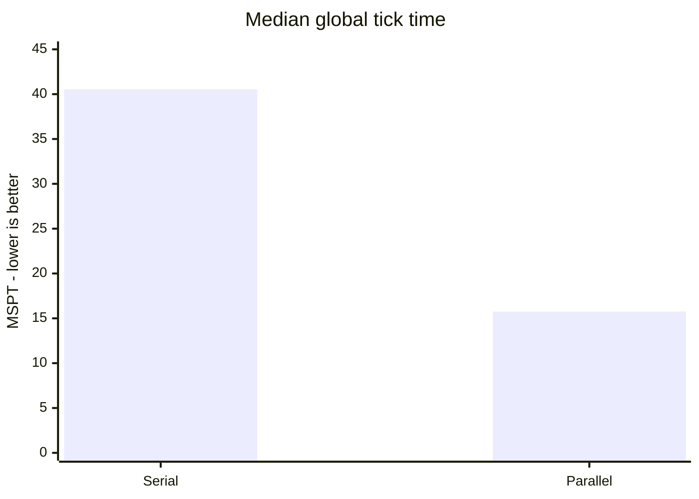
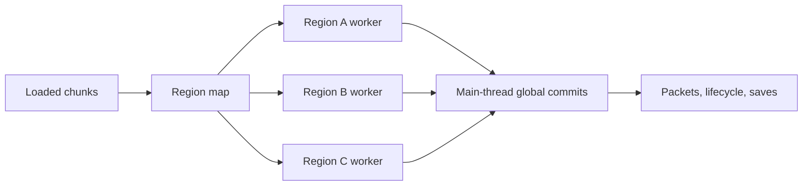

# Optimal

**Independent regional ticking for Minecraft 1.21.1 on NeoForge.** Optimal separates distant loaded
areas so they can run on different CPU cores. If one area becomes too expensive, adaptive
throttling can slow that area without slowing every player on the server.

| Situation | What Optimal does |
| --- | --- |
| Several distant bases are busy | Runs their regions concurrently |
| One region exceeds the server budget | Reduces only that region's simulation rate |
| Two regions become close enough to interact | Merges them before they tick |
| A worker reaches unsafe shared state | Falls back to serial ticking for the session |

Optimal does not split a single hot region into smaller tasks. Dense mobs, machines, pathfinding,
and collisions inside one connected region still run as one unit. It also does not replace
single-thread optimizers such as [Lithium](https://modrinth.com/mod/lithium); the two solve different
problems.

## Current benchmark

The current code was tested in an ABBA sequence with a fresh server restart for every arm. The
workload used four forced-loaded regions 2,048 blocks apart with exactly 1,200 persistent zombies in
each region, or 4,800 total. Both modes used adaptive throttling and the same nine-mod runtime. Only
`parallelTicking` changed.



**Parallel ticking reduced median MSPT by 61.2% and p95 MSPT by 62.5%.** Both parallel arms kept all
four regions at 20 TPS. The serial arms kept zero and one region at 20 TPS because the adaptive
budget had to slow sequential work.

| Mode, median of two arms | Median MSPT | Median p95 | Regions at 20 TPS | Slowest region |
| --- | ---: | ---: | ---: | ---: |
| Serial regional ticking | 40.55 ms | 50.80 ms | 0/4 and 1/4 | 10.0-10.6 TPS |
| **Parallel regional ticking** | **15.75 ms** | **19.05 ms** | **4/4 in both arms** | **20.0 TPS** |

<details>
<summary>Raw arms and benchmark controls</summary>

| Arm | Median MSPT | Median p95 | Regions at 20 TPS | Slowest region |
| --- | ---: | ---: | ---: | ---: |
| Serial A | 40.1 ms | 50.8 ms | 0/4 | 10.0 TPS |
| Parallel A | 15.1 ms | 18.8 ms | 4/4 | 20.0 TPS |
| Parallel B | 16.4 ms | 19.3 ms | 4/4 | 20.0 TPS |
| Serial B | 41.0 ms | 50.8 ms | 1/4 | 10.6 TPS |

- Hardware: Intel Core Ultra 7 255H, 16 cores, Java 21.
- Runtime: Minecraft 1.21.1, NeoForge 21.1.248, Lithium 0.15.4, C2ME
  0.4.0-alpha.0.120, Mekanism and Mekanism Generators 10.7.19.85, Naturalist 2.0.3,
  Citadel 2.7.1, Friends & Foes 4.0.27, Resourceful Lib 3.0.12, and ScalableLux
  0.3.0-alpha.0.8.
- Each arm discarded two 8-second warmup windows, then used the median of five 8-second samples.
- `asyncRegionLoops=false` in both arms so `tick query` included the worker critical path. Shipping
  async mode does not join workers every tick, so its main-thread MSPT is not directly comparable.
- `ItemEntity.Age`, a vanilla field outside Optimal, measured each region's effective TPS.
- Every arm verified exact entity count, separate regions, correct execution mode, drained boundary
  queues, and zero boundary failures. Parallel arms also required worker overlap of at least two.

Reproduce the same serial/parallel sequence with:

```bash
bash tools/ab_parallel.sh 4 1200
```

</details>

This is a synthetic multi-region result, not a universal speedup. One hot region cannot use another
core under the current ownership model, and different entity or machine mixes will scale
differently.

---

## How it works



Region workers own local simulation. Effects that touch global Minecraft or mod state are queued
and committed on the main thread after the source owner is safe.

### Regions

The loaded world is cut into a fixed grid of **sections**, 4x4 chunks each. Sections that are
entity-ticking and near each other are merged into one **region**, a connected component that is
ticked as a unit.

Regions merge when they come within 2 sections of each other, which guarantees that two distinct
regions are always at least 3 sections (192 blocks) apart. Nothing in one region can reach into
another within a single tick, which is what makes them independent.

Regions form and dissolve as chunks load and unload. `/optimal regions` shows the current map.

### Regional TPS: slicing, not skipping

Each region's cost is measured every tick. When the server's tick is heading past its target, the
most expensive region is given a **tick divisor**. At 1/4, its contents advance at 5 TPS while
everything else stays at 20.

The important detail is *how* that slowdown is delivered. The obvious implementation runs the whole
region every fourth tick. That gives the right average and a terrible feel:

| | gated (all work every 4th tick) | sliced (1/4 of the work every tick) |
| --- | --- | --- |
| bystander's TPS | 19.6 | **20.0** |
| MSPT, mean | 20.5 ms | 23.7 ms |
| MSPT, **95th percentile** | **210.9 ms** | **32.9 ms** |

Gating produced a 200 ms hitch every fourth tick. This caused visible stutter for *everyone* from the
mechanism meant to prevent stutter. Slicing runs a quarter of the region's entities every tick
instead. Each entity still advances at 5 TPS, but the cost is spread evenly.

Slice membership is keyed on entity ID and block position, so a given mob or hopper lands in the
same slice every cycle rather than drifting between them.

**When the throttle engages** is decided by the tick as a whole, not by a fixed budget. Everything
that is not region work, including the chunk system, networking, and block entities outside regions, is
overhead the regions cannot control, so their budget is whatever is left of `targetTickMillis`
after paying it. On a server comfortably holding 20 TPS the remainder is large and nothing is
throttled.

### Parallel region ticking

Because regions cannot interact within a tick, they can be ticked on different threads. Doing so
means making everything a region touches safe, which was most of the work:

- **Entity storage is sharded by grid cell.** Vanilla keeps every entity section in one map plus
  one balanced tree. Sharding by *cell* rather than by region matters: a section key's coordinates
  are chunk coordinates, so the shard is a pure function of the key, and regions merging or
  splitting migrates nothing.
- **Entity lifecycle callbacks run on the main thread.** One entity crossing a chunk section
  updates six level-global containers: entity tracking, the player list, mob navigation, dragon
  parts, game-event listeners, and the mod event bus. Workers queue those and the main thread
  replays them, which replaces six concurrency problems with one rule.
- **Scheduled ticks are region-owned.** Each region has an ordinary vanilla `LevelTicks` child;
  chunk tick containers move between children at quiescent topology changes. Owner-local writes
  stay on the worker and cross-owner writes are handed off.
- **Block events are region-owned.** Each region has an ordered, deduplicating queue. Its block
  callbacks run on the owner worker; only successful event packets and positional sound/network
  effects are committed on the main thread.

Each worker owns the region-scoped parts of the spatial envelope. The retained global mutations
are explicit and measured:

| boundary | region-worker work | main-thread commit or global barrier |
| --- | --- | --- |
| scheduled block/fluid ticks | drain the region-owned vanilla `LevelTicks` child | cross-owner scheduling is handed to the destination owner |
| chunk/random ticks | tick with worker-local vanilla random state | chunk/player broadcasts and packet delivery |
| entity ticks | core entity simulation | add/remove lifecycle, persistent callbacks, and entity insertion |
| teleports/dimension changes | request the transition | replay the transition after the source owner is idle |
| block-entity ticks | core block-entity simulation | ticker and fresh block-entity registration |
| block events | ordered owner callback queue | successful packets and positional sound/network effects |
| natural spawning | independent searches with one snapshot and atomic cap reservations | entity insertion and vanilla spawn-state replay |
| custom spawners/mod callbacks | none | arbitrary global mod code remains main-threaded |
| commands | none | quiesce all owners, drain handoffs, then execute the whole command |
| autosave/chunk unload | none while the owner is active | busy autosaves retry and direct saves lease the owner; optional C2ME can serialize unload snapshots on its workers |
| explicit saves and shutdown | none | quiesce and drain before taking the global snapshot or closing storage |
| topology merge/split | none while owners are active | wait affected owners, drain against old ownership, then replace the map |

`/optimal phases` reports queued, replayed, direct, pending, elapsed main-thread time, failures,
balance, and the last source region for each boundary. The counters are bounded by boundary type;
they do not retain an ever-growing region history.

With `asyncRegionLoops=true`, a busy region keeps its ownership claim and misses only its own next
slot; unrelated regions and the global server tick continue without a per-tick join. Targeted
leases protect packets, commands, chunk topology, entity loading/unloading and saves.

Optimal has no build, metadata, or class dependency on C2ME and runs this ownership path standalone.
Vanilla serializes an owner-safe unload chunk on the main thread and writes it asynchronously. When
C2ME is installed, it can additionally run `ChunkSerializer.write` for that unload snapshot on its
workers. Loaded autosave serialization remains an idle-time main-thread slice in either case;
Optimal prevents it from waiting on a busy region.

### Validation coverage

| Check | Result |
| --- | --- |
| JVM regression suite | 81 tests passed |
| Optimal-only NeoForge GameTests | All 5 required tests passed without external mods |
| Scheduled ticks | 30 minutes, 422 rebuild cycles, worker peak 5, no failure or queued work left |
| Block events | 30 minutes, 1,001,984 callbacks, worker peak 4, packets stayed on main |
| Natural spawning | Three parallel runs, worker overlap confirmed, global and local caps held |
| Deferred writes | 6,947 level writes and 2,592 entity callbacks replayed exactly |
| Full-mod save/unload | 1,200 entities survived a 49-chunk unload/reload exactly |
| Main-thread boundaries | 8,519 deferred operations balanced with zero pending work |

These checks cover the listed runtime and workloads. They cannot prove that arbitrary mod code is
thread-safe; the serial fallback remains part of the design.

---

## The trade-off

Read this before running it on a server people play on.

When a region exceeds its share, **its contents run slower**. Mobs move at reduced speed,
farms produce less, hoppers move fewer items. That is the mechanism working as designed: a griefer's
lag machine is *supposed* to be slowed. But the throttle cannot tell a lag machine from a
legitimately busy base, and it will slow either.

If you would rather the server dropped below 20 TPS than slow anyone's build down, set
`regions.adaptiveThrottling = false`. Region tracking stays on and you keep the `/optimal regions`
diagnostics.

---

## Configuration

`config/optimal-common.toml`.

| option | default | what it does |
| --- | --- | --- |
| `regions.enabled` | `true` | region tracking; off makes the mod inert |
| `regions.adaptiveThrottling` | `true` | the regional TPS system |
| `regions.budgetMillis` | `25.0` | minimum budget retained for region work |
| `regions.targetTickMillis` | `45.0` | tick time to steer toward; raise to intervene later |
| `regions.maxTickDivisor` | `16` | slowest a region may be driven (1.25 TPS) |
| `regions.minThrottleMillis` | `2.0` | regions cheaper than this are never slowed |
| `regions.sectionShift` | `2` | region grid granularity, 4x4 chunks |
| `regions.parallelTicking` | `true` | tick regions on worker threads |
| `regions.directWorkerChunkReads` | `true` | resolve loaded worker chunk reads before synchronous-load instrumentation |
| `regions.parallelNaturalSpawning` | `true` | run owner-region spawn searches concurrently with level-wide cap reservations |
| `regions.shardEntityStorage` | `true` | storage isolation required by `parallelTicking` |
| `regions.asyncRegionLoops` | `true` | independent per-region loops without a per-tick barrier |
| `regions.scopedScheduledTicks` | `true` | region-own block/fluid schedulers; false uses one serial fallback child |
| `regions.scopedBlockEvents` | `true` | region-own block-event callbacks; false uses the serial fallback queue |

To return to serial regional ticking while diagnosing a mod conflict:

```toml
parallelTicking = false
asyncRegionLoops = false
```

### Commands

- `/optimal regions`: region map, per-region cost and tick rate, execution mode
- `/optimal phases`: worker/main calls, time, overlap, lock wait, failures and deferred queue depth
- `/optimal violations`: thread-ownership violations recorded (should be empty)
- `/optimal visualize`: stable region map plus GPU-rendered perimeter curtains; `T#` is the
  pooled worker that most recently ran the region

When Lithium is installed, Optimal disables Lithium's `alloc.chunk_random` and
`entity.inactive_navigations` mixins through Lithium's supported mod override metadata. Both keep
mutable state once per level; Optimal replaces the useful parts with worker-local random state and
an atomic path-type cache so the full chunk/path operation does not need a global monitor.

---

## Compatibility

Tested compatible with independent region loops on:

- NeoForge alone, no other mods
- Lithium 0.15.4 + Mekanism 10.7.19.85 + Mekanism Generators 10.7.19.85 + Naturalist 2.0.3 +
  Citadel 2.7.1 + Friends & Foes 4.0.27 + Resourceful Lib 3.0.12 + ScalableLux 0.3.0-alpha.0.8
- C2ME 0.4.0-alpha.0.120 with the full mod set above

Verified across both: entity queries return byte-identical results with sharding on and off
(0 differences across 25 spatial queries), block entities and scheduled ticks behave unchanged, and
no thread-ownership violations or fallbacks to serial occurred. Vanilla and Naturalist retention
probes pass, all six tested Generators blocks create block entities, and two real clients negotiate
the optional visualizer payload while three regions run concurrently.

Lithium is handled explicitly. Its spawning optimization
reads entity storage internals directly, and the sharded storage keeps that working. Region block
entities can register Lithium world-border listeners concurrently, so that narrow registration
method is serialized; this avoids racing Lithium's internal `WeakHashMap` without locking ticks.

---

## Limitations

Stated plainly; the safe fallback reduces risk but cannot make unknown mods thread-safe.

- **Arbitrary mods are not protected.** Four level-global containers reachable from an entity tick
  have been found and fixed; a mod with its own such container would race the same way.
- **C2ME 0.4.0-alpha.0.120 has one test limitation.** Full live benchmarks, save/unload, restart,
  and shutdown pass with C2ME installed. Its natural-spawning GameTest fails in both serial and
  parallel regional modes, so that specific test is not counted as passing compatibility coverage.
- Numbers above are from a synthetic benchmark on one machine. Your server is not this benchmark.

---

## Building

```
./gradlew build          # requires JDK 21
./gradlew runServer      # dev server with RCON on 25585
python tools/bench_isolation.py --mobs 6000
python tools/bench_parallel.py --areas 4 --mobs 1200
python tools/verify_blockevents.py --soak-seconds 1800
```

The benchmark scripts read the RCON password from `OPTIMAL_RCON_PASSWORD`; use the same value for
`rcon.password` in the dev server's local `server.properties`.
